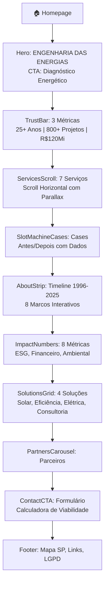
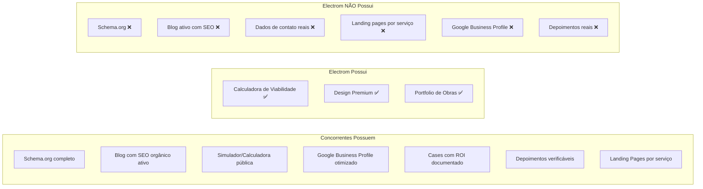

# 📊 Análise Estratégica Completa — Site Electrom Engenharia

**Projeto:** [site-electrom](file:///c:/Users/gusta/Downloads/siteElectrom/site-electrom)
**Autor:** Antigravity AI (Análise de Engenharia de Software, SEO e UX)
**Data:** 03 de Julho de 2026
**Versão:** 1.0 — Documento Consultável

---

## 📑 Índice

1. [Contexto e Objetivo da Análise](#1-contexto-e-objetivo)
2. [Referencial Teórico](#2-referencial-teórico)
3. [Análise de SEO Técnico](#3-análise-de-seo-técnico)
4. [Análise de Performance](#4-análise-de-performance)
5. [Estratégia e Hierarquia das Informações](#5-estratégia-e-hierarquia-das-informações)
6. [Experiência do Usuário (UX)](#6-experiência-do-usuário-ux)
7. [Benchmarking — Análise de Concorrentes](#7-benchmarking--análise-de-concorrentes)
8. [Débitos Técnicos e Inconsistências Críticas](#8-débitos-técnicos-e-inconsistências-críticas)
9. [Plano de Ação Priorizado](#9-plano-de-ação-priorizado)
10. [Referências Bibliográficas](#10-referências-bibliográficas)

---

## 1. Contexto e Objetivo

A **Electrom Engenharia** é uma empresa com **30+ anos de experiência** no setor de engenharia elétrica, subestações, energia solar fotovoltaica e consultoria energética, atuando no estado de São Paulo. Busca reposicionar-se como **"Engenharia das Energias"** e consolidar autoridade digital.

O presente relatório analisa criticamente o site institucional sob **7 dimensões** estratégicas, técnicas e de experiência do usuário, com o objetivo de identificar gargalos, oportunidades e propor ações concretas priorizadas.

> [!IMPORTANT]
> Esta análise é embasada em referencial teórico consagrado e benchmarking real com concorrentes diretos e indiretos do nicho brasileiro de engenharia elétrica e energia solar.

---

## 2. Referencial Teórico

A fundamentação desta análise baseia-se nos seguintes pilares:

| Área | Referência | Conceito Central |
|---|---|---|
| **Hierarquia de Informações** | Steve Krug — *"Don't Make Me Think"* (2014) | O usuário não deve ter que pensar para encontrar o que precisa. Cada clique precisa ser óbvio. |
| **Arquitetura de Informação** | Peter Morville & Louis Rosenfeld — *"Information Architecture for the Web"* (2015) | Organização, rotulação e navegação de conteúdo devem ser guiadas por necessidades do usuário. |
| **SEO Técnico** | Google Search Central — *"Search Quality Evaluator Guidelines"* (2024) | E-E-A-T (Experience, Expertise, Authoritativeness, Trustworthiness) como pilar de ranking. |
| **Dados Estruturados** | Schema.org + RFC 5861 (SWR) | Structured Data como camada de confiança entre site e motores de busca/AI. |
| **UX Persuasiva** | BJ Fogg — *"Persuasive Technology"* (Stanford, 2003) | Credibilidade web é construída por design, conteúdo e comportamento esperado. |
| **Performance Web** | Google — *"Core Web Vitals"* (LCP, INP, CLS) | Performance de carregamento, interatividade e estabilidade visual como fatores de ranking diretos. |
| **Clean Architecture** | Robert C. Martin — *"Clean Architecture"* (2017) | SRP, desacoplamento e separação de responsabilidades. |

---

## 3. Análise de SEO Técnico

### 3.1 O que está BEM ✅

| Item | Status | Detalhes |
|---|---|---|
| **Meta Title** | ✅ Bom | `"Electrom Engenharia \| Engenharia Elétrica, Subestações & Energia Solar"` — Descritivo, com palavras-chave relevantes. |
| **Meta Description** | ✅ Bom | 160 caracteres com proposta de valor clara e keywords alinhadas. |
| **Keywords Array** | ✅ Presente | 8 keywords relevantes incluindo "São Paulo" para localização. |
| **Open Graph (OG)** | ✅ Completo | Título, descrição, URL canônica, locale `pt_BR`, imagem com dimensões corretas (1200x630). |
| **lang="pt-BR"** | ✅ Correto | Atributo de idioma presente no `<html>`. |
| **Favicon** | ✅ Presente | `/favicon.ico` configurado. |
| **Next.js Font Optimization** | ✅ Correto | Usando `next/font/google` com `display: swap` (evita FOIT). |
| **Responsividade** | ✅ Mobile-first | Componentes com breakpoints `md:` e `lg:` consistentes. |

### 3.2 O que está AUSENTE ou FRACO 🔴

#### 🔴 Problema Crítico 1: Ausência Total de Dados Estruturados (Schema.org/JSON-LD)

Não há **nenhum** script de Dados Estruturados (`JSON-LD`) em nenhuma página do site. Isso é crítico para um negócio local de engenharia.

**Schemas Ausentes e Necessários:**

| Schema | Propósito | Impacto de Ausência |
|---|---|---|
| `LocalBusiness` | Nome, endereço, telefone, horário, área de atuação | Google Maps, Knowledge Panel, e Google Business Profile não têm link com o site |
| `Organization` | Logo, redes sociais, fundadores | Sem Knowledge Graph; perda de brand SERP |
| `Service` | Listar cada serviço oferecido com descrição | Reduz discoverability para buscas tipo "subestação SP", "energia solar industrial" |
| `FAQPage` | Perguntas frequentes estruturadas | Perde oportunidade de rich snippets e Voice Search |
| `Article` / `BlogPosting` | Posts de blog estruturados | Posts não competem em rich results |
| `Review` / `AggregateRating` | Avaliações de clientes | Sem estrelas de avaliação nos resultados de busca |
| `BreadcrumbList` | Migalhas de pão | Sem navegação clara nos resultados de busca |

> [!CAUTION]
> Em 2026, concorrentes como **Órigo Energia**, **Blue Sol** e **Enel X** utilizam Dados Estruturados extensivos. A ausência total destes coloca a Electrom em **desvantagem severa** nos rankings orgânicos e na descoberta por AIs (Google AI Overviews, ChatGPT Search, etc.).

#### 🔴 Problema Crítico 2: Ausência de `sitemap.xml` e `robots.txt`

Nenhum arquivo `sitemap.xml` ou `robots.txt` foi encontrado na raiz do projeto. Sem esses arquivos:
- Crawlers não possuem mapa de descoberta das páginas
- Não há controle sobre o que deve ou não ser indexado
- Páginas internas como `/legal` podem ser priorizadas indevidamente

#### 🔴 Problema Crítico 3: Falta de Metadata por Página

Apenas o [layout.tsx](file:///c:/Users/gusta/Downloads/siteElectrom/site-electrom/src/app/layout.tsx) possui metadata exportada. As páginas internas **NÃO** possuem `export const metadata` próprio:

| Página | Title Próprio? | Description Própria? |
|---|---|---|
| `/sobre` | ❌ Não | ❌ Não |
| `/solucoes` | ❌ Não | ❌ Não |
| `/blog` | ❌ Não | ❌ Não |
| `/contato` | ❌ Não | ❌ Não |
| `/cases` | ❌ Não | ❌ Não |
| `/sustentabilidade` | ❌ Não | ❌ Não |
| `/legal` | ❌ Não | ❌ Não |

**Impacto:** Todas as páginas compartilham o mesmo título e descrição nos resultados de busca, o que dilui a relevância por keyword e prejudica a taxa de clique (CTR).

#### 🟡 Problema Moderado 4: Hierarquia de Headings (H1) Inconsistente

- **Homepage:** Possui `<h1>` corretamente em [HeroSection.jsx](file:///c:/Users/gusta/Downloads/siteElectrom/site-electrom/src/components/HeroSection.jsx#L92) com "ENGENHARIA DAS ENERGIAS".
- **Blog (`/blog`):** O `<h1>` na [page.tsx](file:///c:/Users/gusta/Downloads/siteElectrom/site-electrom/src/app/blog/page.tsx#L174) é genérico: `"Blog"` — sem keywords ou proposta de valor.
- **Contato (`/contato`):** Possui `<h1>` bom: "Fale com engenheiros especialistas em energia".
- **Sobre (`/sobre`):** `<h1>` genérico: "25 Anos de Energia com Propósito" — poderia incluir "Electrom Engenharia".

#### 🟡 Problema Moderado 5: Falta de Link Canonical Explícito e Hreflang

Não há tags `<link rel="canonical">` explícias nem `hreflang` para evitar problemas de conteúdo duplicado.

#### 🟡 Problema Moderado 6: Imagens sem Alt Text Estratégico

Muitas imagens da timeline e serviços usam alt texts genéricos que não contêm keywords de SEO. Exemplo:
- `alt="Electrom Logo"` — OK mas poderia ser `"Electrom Engenharia - Engenharia das Energias"`
- Alt texts das imagens de obras não mencionam o tipo de projeto ou localização

---

## 4. Análise de Performance

### 4.1 Arquitetura e Bundle

| Fator | Status | Análise |
|---|---|---|
| **Framework** | Next.js (App Router, React 19) | ✅ Excelente — SSR/SSG nativo, otimização automática |
| **Estilização** | Tailwind CSS v3.3.0 | ✅ Purging eficiente de CSS não utilizado |
| **Animações** | Framer Motion v12 | ⚠️ Pesado — ~40KB gzip. Todos os componentes são `'use client'` |
| **Carrossel** | Keen Slider v6.8 | ✅ Leve (~6KB gzip) |
| **Ícones** | react-icons (FaSearch, etc.) | ⚠️ Tree-shaking necessário — importação seletiva OK |
| **Imagens** | next/image com `fill` e `priority` | ✅ Otimização automática (WebP/AVIF) |

### 4.2 Problemas de Performance Identificados

#### 🔴 Todos os Componentes São Client-Side (`'use client'`)

**100% dos componentes** da homepage são marcados como `'use client'`, incluindo componentes que poderiam ser Server Components estáticos:

| Componente | Requer Client? | Motivo da Necessidade |
|---|---|---|
| [HeroSection](file:///c:/Users/gusta/Downloads/siteElectrom/site-electrom/src/components/HeroSection.jsx) | ✅ Sim | `useScroll` do Framer Motion |
| [TrustBar](file:///c:/Users/gusta/Downloads/siteElectrom/site-electrom/src/components/TrustBar.jsx) | ✅ Sim | CountUp + Framer |
| [ServicesHorizontalScroll](file:///c:/Users/gusta/Downloads/siteElectrom/site-electrom/src/components/ServicesHorizontalScroll.jsx) | ✅ Sim | Scroll horizontal + Framer |
| [SlotMachineCases](file:///c:/Users/gusta/Downloads/siteElectrom/site-electrom/src/components/SlotMachineCases.jsx) | ✅ Sim | Animações interativas |
| [AboutStrip](file:///c:/Users/gusta/Downloads/siteElectrom/site-electrom/src/components/AboutStrip.jsx) | ✅ Sim | `useState` + AnimatePresence |
| [ImpactNumbers](file:///c:/Users/gusta/Downloads/siteElectrom/site-electrom/src/components/ImpactNumbers.jsx) | ✅ Sim | CountUp + parallax |
| [SolutionsGrid](file:///c:/Users/gusta/Downloads/siteElectrom/site-electrom/src/components/SolutionsGrid.jsx) | ⚠️ Questionável | Somente `whileInView` — poderia ser lazy |
| [PartnersCarousel](file:///c:/Users/gusta/Downloads/siteElectrom/site-electrom/src/components/PartnersCarousel.jsx) | ✅ Sim | Keen Slider |
| [ContactCTA](file:///c:/Users/gusta/Downloads/siteElectrom/site-electrom/src/components/ContactCTA.jsx) | ✅ Sim | Formulário + calculadora |
| [Footer](file:///c:/Users/gusta/Downloads/siteElectrom/site-electrom/src/components/Footer.jsx) | ⚠️ Questionável | `useState` para newsletter — poderia ser separado |

**Impacto:** O JavaScript bundle da homepage é **excepcionalmente grande** porque todo o conteúdo estático (textos, imagens, estrutura) precisa ser hidratado no cliente. Isso degrada o **LCP (Largest Contentful Paint)** e o **TBT (Total Blocking Time)**.

#### 🟡 Horizontal Scroll Consome `700vh` de Altura

A seção [ServicesHorizontalScroll](file:///c:/Users/gusta/Downloads/siteElectrom/site-electrom/src/components/ServicesHorizontalScroll.jsx#L354) reserva `h-[700vh]` no DOM para simular scroll horizontal:
- Aumenta significativamente o **CLS (Cumulative Layout Shift)** durante o carregamento
- Em mobile, muda para layout vertical empilhado (correto), mas a seção desktop infla o DOM

#### 🟡 Dependência `next: "latest"` sem Pinning

Em [package.json](file:///c:/Users/gusta/Downloads/siteElectrom/site-electrom/package.json#L14-L16), as versões de `next`, `react` e `react-dom` estão como `"latest"`. Isso cria **builds não-reproduzíveis** — uma atualização breaking pode quebrar o site em produção sem nenhuma alteração de código.

---

## 5. Estratégia e Hierarquia das Informações

### 5.1 Mapa Atual da Informação na Homepage



### 5.2 Análise Crítica da Hierarquia

#### 🔴 Redundância de Informação Excessiva

Há **triplicação** de informações numéricas entre componentes da homepage:

| Métrica | TrustBar | ImpactNumbers | AboutStrip | Sobre Page |
|---|---|---|---|---|
| Anos de experiência | `25+` | `30+` | Timeline mostra `1996-2025` | `25 Anos` (H1) |
| Projetos entregues | `800+` | `500+` | — | `1000+` |
| Economia | `R$ 120 Mi` | `R$ 50M+` | — | `250 GWh` |
| Clientes | — | `1800+` | — | `300` |

> [!WARNING]
> **Esta inconsistência numérica destrói a credibilidade.** Segundo BJ Fogg (Stanford), a credibilidade web é construída pela coerência entre dados exibidos. Quando o visitante vê "800+" em um lugar e "500+" em outro, assume-se que os dados são inventados. **Este é o problema mais grave de UX do site inteiro.**

#### 🟡 Ordem de Seções Subótima para Conversão

A homepage segue o fluxo: **Hero → Trust → Serviços → Cases → About → Números → Soluções → Parceiros → Contato**.

**Problemas estratégicos:**
1. **Soluções aparece DEPOIS de Cases e About** — O visitante vê cases de projetos sem antes ter entendido o que a empresa faz. O modelo AIDA (Attention → Interest → Desire → Action) exige que a proposta de valor venha antes da prova social.
2. **Dois blocos de soluções/serviços na mesma página** — `ServicesHorizontalScroll` (7 serviços detalhados) e `SolutionsGrid` (4 soluções em grid) competem por atenção com conteúdos sobrepostos.
3. **About Strip (Timeline) interrompe o funil** — Está entre Cases e Impact Numbers, quebrando o momentum de conversão.

#### Hierarquia Recomendada (Referência AIDA + Modelo de Persuasão Fogg):

```
Hero (Atenção) → TrustBar (Credibilidade Rápida) → SolutionsGrid (Interesse/Proposta)
→ ServicesScroll OU Cases (Desejo/Prova) → ImpactNumbers (Amplificação)
→ Parceiros (Validação Social) → ContactCTA (Ação) → Footer
```

A **AboutStrip** deveria ser exclusiva da página `/sobre`, não da homepage.

#### 🔴 Ausência de Blog Preview na Homepage

O componente [BlogPreview.jsx](file:///c:/Users/gusta/Downloads/siteElectrom/site-electrom/src/components/BlogPreview.jsx) **existe e está funcional** (já busca posts do WordPress), mas **NÃO é importado na homepage** ([page.tsx](file:///c:/Users/gusta/Downloads/siteElectrom/site-electrom/src/app/page.tsx)). Isso desperdiça:
- Oportunidade de SEO (conteúdo fresco na homepage)
- Tráfego orgânico de long-tail keywords
- Nutrição de leads (conforme o PCI identificado na documentação)

#### 🟡 Navbar com Poucos Itens de Navegação

A [Navbar](file:///c:/Users/gusta/Downloads/siteElectrom/site-electrom/src/components/Navbar.tsx#L25-L29) possui apenas 3 links:
- Home
- Sustentabilidade
- Blog

**Páginas existentes mas ausentes da navegação:**
- `/sobre` — Legado e autoridade
- `/solucoes` — Oferta de serviços
- `/cases` — Prova social
- `/contato` (está como CTA, correto)

> [!IMPORTANT]
> Um visitante que não rola até o footer **não tem como navegar para Soluções, Sobre ou Cases** — páginas críticas para conversão B2B. Segundo Morville & Rosenfeld, a navegação primária deve refletir as necessidades informacionais prioritárias do público-alvo.

---

## 6. Experiência do Usuário (UX)

### 6.1 Pontos Fortes ✅

| Aspecto | Nota | Justificativa |
|---|---|---|
| **Design Visual** | ⭐⭐⭐⭐⭐ | Estética premium, glassmorphism, blueprint grid, paleta de cores coesa e profissional |
| **Micro-animações** | ⭐⭐⭐⭐⭐ | Mask reveal, parallax, stagger, hover effects — sofisticação técnica de primeiro nível |
| **Tipografia** | ⭐⭐⭐⭐ | Inter + Space Grotesk bem aplicadas. `font-display: swap` correto |
| **Calculadora de Viabilidade** | ⭐⭐⭐⭐⭐ | Ferramenta interativa real com perfis residencial/corporativo, solar/MLE, economia calculada |
| **Timeline Interativa** | ⭐⭐⭐⭐ | AboutStrip com marco visual e detalhes relevantes por ano |
| **Scroll Horizontal de Serviços** | ⭐⭐⭐⭐ | Imersivo no desktop com parallax, testimonials por slide e progress bar |
| **Footer com Mapa SVG** | ⭐⭐⭐⭐⭐ | Mapa operacional interativo animado — diferencial único no setor |

### 6.2 Problemas de UX Identificados 🔴

#### 🔴 Página `/blog` com Estilo Completamente Diferente do Site

A [página de blog](file:///c:/Users/gusta/Downloads/siteElectrom/site-electrom/src/app/blog/page.tsx#L170-L347) utiliza um **design system completamente diferente** do restante do site:

| Aspecto | Homepage / Outras Páginas | Página `/blog` |
|---|---|---|
| Background | `bg-brand-petrol` (escuro) | Branco (`bg-white`) |
| Cards | `glass-card` glassmorphism | `bg-white rounded-lg shadow-lg` (Material básico) |
| Tipografia | `font-display`, mono | Padrão do navegador |
| Animações | Framer Motion stagger | Nenhuma animação |
| Skeleton Loading | Glass-card com border-white/5 | `bg-gray-200` (fundo claro) |
| Filtros | Estilo blueprint | `bg-gray-100 text-gray-700` |

**Impacto:** A transição visual é chocante. O visitante sente que saiu do site da Electrom e entrou em outro site completamente diferente. Isso destrói a percepção de qualidade e profissionalismo.

#### 🔴 Página `/sobre` com Dados Placeholder

Na página [sobre/page.tsx](file:///c:/Users/gusta/Downloads/siteElectrom/site-electrom/src/app/sobre/page.tsx):
- **Fundador:** "Eng. João Mendes" com CREA `000000000` — Dados claramente fictícios
- **Equipe:** Card com "Nome Sobrenome" e "Cargo" — Placeholder não preenchido
- **Foto do fundador:** Comentada (`{/*  */}`)
- **Hero image:** Comentada (`{/*  */}`)
- **Números:** Divergentes da homepage (1000+ projetos vs 800+/500+)
- **Timeline:** Dados diferentes da timeline da homepage (1997 vs 1996)

#### 🔴 Página `/contato` com Dados Genéricos

Na [contato/page.tsx](file:///c:/Users/gusta/Downloads/siteElectrom/site-electrom/src/app/contato/page.tsx):
- **Telefone:** `(11) 1234-5678` — Claramente fictício
- **WhatsApp:** `(11) 98765-4321` — Diferente do WhatsApp do ContactCTA da homepage
- **Endereço:** `Av. Paulista, 1000 - Bela Vista` — Genérico
- **Formulário:** `handleSubmit` simula envio com `setTimeout` — Não envia dado nenhum

#### 🟡 Formulário do ContactCTA da Homepage Não Envia Dados

Em [ContactCTA.jsx](file:///c:/Users/gusta/Downloads/siteElectrom/site-electrom/src/components/ContactCTA.jsx#L37-L48), o `handleSubmit` apenas faz `console.log`:
```javascript
console.log('Dados do Lead:', { ...formData, message: ... })
setSubmitted(true)
```
**Nenhum lead é realmente capturado.** Não há integração com API de e-mail, CRM ou banco de dados.

#### 🟡 WhatsApp com Número Fictício

Nos contatos do ContactCTA: `https://wa.me/5548999999999` — Número fictício. A mensagem de WhatsApp jamais chegará.

#### 🟡 Newsletter do Footer Não Funcional

Em [Footer.jsx](file:///c:/Users/gusta/Downloads/siteElectrom/site-electrom/src/components/Footer.jsx#L11-L20), o `handleSubscribe` simula sucesso:
```javascript
setSubscribed(true)
setTimeout(() => { setSubscribed(false); setEmail(''); }, 4000)
```
Nenhum e-mail é coletado. Mas **o formulário de newsletter foi removido do componente visual** (existe o handler mas não o input no JSX). Inconsistência de código morto.

---

## 7. Benchmarking — Análise de Concorrentes

### 7.1 Concorrentes Diretos e Indiretos Mapeados

| Empresa | Posicionamento | Site | Diferencial Digital |
|---|---|---|---|
| **Órigo Energia** | Geração distribuída por assinatura | origoenergia.com.br | Simulador online, SEO local agressivo, calculadora integrada |
| **Blue Sol** | Integração solar + franchising | bluesol.com.br | Blog robusto com SEO orgânico, schema markup, academy |
| **Enel X Brasil** | Soluções "beyond the grid" | enelx.com/br | Branding premium, multilingual, schema completo |
| **Siemens Energy** | Infraestrutura de grande porte | siemens-energy.com/br | Autoridade máxima, cases com dados reais, investor relations |
| **AXIA Energia** | Geração, transmissão e comercialização | axia.com.br | Dashboard de dados, relatórios de impacto ESG |
| **Sinergia Consultoria** | Estudos elétricos avançados | sinergiaconsultoria.com.br | Conteúdo técnico profundo, parceria CEPEL |

### 7.2 Gaps Competitivos Identificados



### 7.3 Análise de Conteúdo vs Concorrentes

| Critério | Electrom | Blue Sol | Órigo | Enel X |
|---|---|---|---|---|
| **Blog active** | ❌ Mockado/CMS não integrado | ✅ 100+ artigos SEO | ✅ Blog + Academy | ✅ Blog + Relatórios |
| **FAQ estruturada** | ❌ Ausente | ✅ Schema FAQ | ✅ FAQ por serviço | ✅ FAQ + chatbot |
| **Calculadora pública** | ✅ Existe (excelente) | ✅ Simulador solar | ✅ Simule sua economia | ✅ ROI calculator |
| **SEO local** | ❌ Sem schema LocalBusiness | ✅ Por cidade/região | ✅ Por estado | ✅ Nacional |
| **Cases quantificados** | ⚠️ Parcial (kWp, mas sem ROI) | ✅ Antes/depois + $$ | ✅ Cases documentados | ✅ Cases + relatórios |
| **Autoridade técnica** | ⚠️ Dados genéricos | ✅ Parcerias fabricantes | ✅ Dados ANEEL | ✅ Papers e patentes |

---

## 8. Débitos Técnicos e Inconsistências Críticas

### 8.1 Resumo Executivo de Débitos

| # | Severidade | Débito | Arquivo(s) | Impacto |
|---|---|---|---|---|
| 1 | 🔴 Crítico | Dados numéricos inconsistentes entre componentes | TrustBar, ImpactNumbers, AboutStrip, Sobre | **Destrói credibilidade** |
| 2 | 🔴 Crítico | Formulários não enviam dados reais | ContactCTA, Contato | **Zero captura de leads** |
| 3 | 🔴 Crítico | Dados de contato fictícios (tel, WhatsApp, endereço) | ContactCTA, Footer, Contato | **Impossibilidade de contato real** |
| 4 | 🔴 Crítico | Página `/blog` com design divergente | [blog/page.tsx](file:///c:/Users/gusta/Downloads/siteElectrom/site-electrom/src/app/blog/page.tsx) | **Quebra de identidade visual** |
| 5 | 🔴 Crítico | Sem Schema.org/JSON-LD | Todas as páginas | **Invisibilidade em rich results** |
| 6 | 🟡 Alto | Navbar sem links para Soluções, Sobre, Cases | [Navbar.tsx](file:///c:/Users/gusta/Downloads/siteElectrom/site-electrom/src/components/Navbar.tsx#L25-L29) | **Navegação bloqueada** |
| 7 | 🟡 Alto | Sem metadata individual por página | Todas as pages exceto layout | **SEO diluído** |
| 8 | 🟡 Alto | Sem `sitemap.xml` e `robots.txt` | Raiz do projeto | **Crawling prejudicado** |
| 9 | 🟡 Alto | BlogPreview não usado na homepage | [page.tsx](file:///c:/Users/gusta/Downloads/siteElectrom/site-electrom/src/app/page.tsx) | **Oportunidade perdida** |
| 10 | 🟡 Médio | Dependências sem version pinning (`latest`) | [package.json](file:///c:/Users/gusta/Downloads/siteElectrom/site-electrom/package.json) | **Build não-reproduzível** |
| 11 | 🟡 Médio | Página `/sobre` com dados placeholder | [sobre/page.tsx](file:///c:/Users/gusta/Downloads/siteElectrom/site-electrom/src/app/sobre/page.tsx) | **Página não publicável** |
| 12 | 🟢 Baixo | Código morto: handler de newsletter no Footer sem input | [Footer.jsx](file:///c:/Users/gusta/Downloads/siteElectrom/site-electrom/src/components/Footer.jsx#L8-L20) | **Código confuso** |
| 13 | 🟢 Baixo | Hook `usePartners.js` não utilizado pelo `PartnersCarousel` | [usePartners.js](file:///c:/Users/gusta/Downloads/siteElectrom/site-electrom/src/hooks/usePartners.js) | **SRP violado** |

---

## 9. Plano de Ação Priorizado

### 🔥 Prioridade 1 — Fundação Crítica (Sem isso o site não pode ir ao ar)

*   **1.1 Unificar dados numéricos** em uma única fonte de verdade (data file).
*   **1.2 Substituir dados de contato fictícios** por dados reais do cliente.
*   **1.3 Integrar envio real de formulários** (usaremos Resend/API route ou similar).
*   **1.4 Substituir WhatsApp fictício** pelo número real.

### ⚡ Prioridade 2 — SEO Fundamental

*   **2.1 Adicionar metadata individual** para cada página.
*   **2.2 Implementar Schema.org JSON-LD**.
*   **2.3 Gerar `sitemap.xml`** dinâmico e `robots.txt`.
*   **2.4 Completar a Navbar** com links para as páginas internas.

### 🎨 Prioridade 3 — Coerência Visual e UX

*   **3.1 Redesenhar página `/blog`** para seguir o design system dark/glass.
*   **3.2 Completar página `/sobre`** com dados reais e design coerente.
*   **3.3 Completar página `/contato`** com design dark.
*   **3.4 Adicionar BlogPreview na homepage**.

---

## 10. Referências Bibliográficas

1. **KRUG, Steve.** *Don't Make Me Think, Revisited*. New Riders, 2014.
2. **MARTIN, Robert C.** *Clean Architecture*. Prentice Hall, 2017.
3. **GOOGLE.** *Search Quality Evaluator Guidelines (E-E-A-T)*. Google Search Central, 2024.
