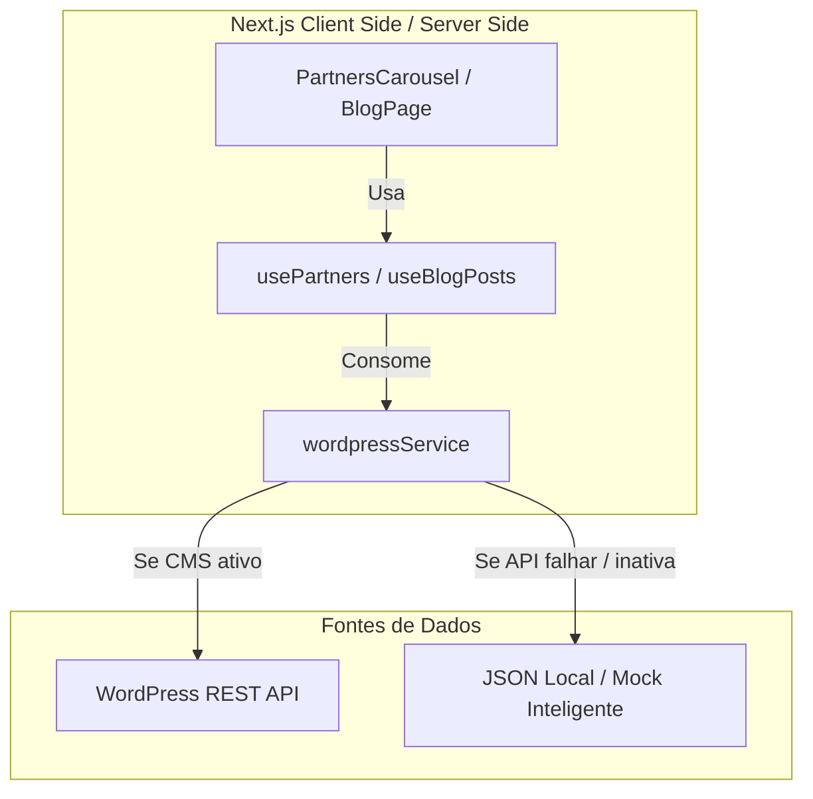

# 📊 Relatório de Análise de Arquitetura, Qualidade de Software e Integração CMS

**Projeto:** ElectROM Engenharia (site-ElectROM)  
**Autor:** Antigravity (AI Coding Assistant)  
**Data:** 31 de Maio de 2026  
**Status:** Concluído  

---

## 🎯 1. Introdução e Objetivo

Este relatório apresenta uma análise crítica e abrangente da arquitetura de software, qualidade de código e conformidade com padrões de engenharia modernos do **Site ElectROM**, construído sobre o framework **Next.js** (App Router).

O objetivo principal é identificar gargalos de arquitetura, inconsistências de design e débitos técnicos, além de propor soluções estruturadas e sustentáveis fundamentadas em **Engenharia de Software** e **Referencial Teórico** consagrado. Focamos em transitar o sistema de um estado semi-mockado para uma arquitetura híbrida de produção altamente desacoplada e escalável (Headless CMS com WordPress).

---

## 📚 2. Referencial Teórico

A fundamentação teórica deste relatório baseia-se nos seguintes pilares da ciência da computação e arquitetura de software:

### 2.1. Princípio de Responsabilidade Única (SRP) e Desacoplamento (SOLID)
Segundo **Robert C. Martin (Uncle Bob)** em *"Clean Architecture: A Craftsman's Guide to Software Structure and Design"*, uma classe ou módulo deve ter um, e apenas um, motivo para mudar. No contexto de aplicações React/Next.js moderno:
*   **Componentes de UI** devem se preocupar apenas em como os dados são renderizados (*Presentation*).
*   **Hooks Customizados** devem gerenciar o estado e os efeitos colaterais (*State & Data Management*).
*   **Serviços** devem abstrair a infraestrutura externa e protocolos de rede (*Infrastructure/API Client*).

O acoplamento rígido de arquivos JSON estáticos ou chamadas diretas a APIs dentro de componentes de apresentação viola o SRP e cria um software rígido, frágil e de difícil manutenção.

### 2.2. Arquitetura Headless CMS e Padrão de Fallback Híbrido
De acordo com a literatura moderna de desenvolvimento web (Vercel e Jamstack Foundations):
*   O uso de um **Headless CMS** (como WordPress via REST API) permite separar o gerenciamento de conteúdo da lógica de exibição, conferindo autonomia para equipes não técnicas (Marketing) enquanto mantém a performance do frontend.
*   **Estratégias de Fallback Estático** funcionam como redes de segurança cruciais contra falhas de rede (`network partitions`). Ter dados estruturados em JSON que substituem a API de forma automática no ambiente de desenvolvimento ou em caso de indisponibilidade da API do CMS é uma prática recomendada de resiliência e tolerância a falhas.

### 2.3. Otimização de Estado de Rede: SWR (Stale-While-Revalidate)
O padrão de caching **Stale-While-Revalidate** (RFC 5861) popularizado por bibliotecas como `swr` ou `React Query`:
1.  Retorna dados em cache imediatamente (stale).
2.  Dispara uma requisição de revalidação em segundo plano (revalidate).
3.  Atualiza a tela com as informações mais recentes se houver mudanças.

Isso elimina telas de carregamento (*loading shimmers*) para o usuário final, otimiza o consumo de banda e gerencia requisições duplicadas.

---

## 🔎 3. Diagnóstico do Estado Atual do Projeto

### 3.1. Visão Geral da Pilha Tecnológica
*   **Framework:** Next.js (App Router, React 19)
*   **Estilização:** Tailwind CSS (v3.3.0) com animações via **Framer Motion** e carrossel via **Keen Slider**.
*   **Cliente HTTP:** Axios para comunicação assíncrona.
*   **Tipagem:** TypeScript.

---

### 3.2. Análise Detalhada dos Componentes e Débitos Técnicos

Após uma varredura completa nas principais pastas (`src/app`, `src/components`, `src/services`, `src/hooks`, `src/data`), foram identificadas discrepâncias arquiteturais severas:

#### ❌ Inconsistência 1: Acoplamento no Carrossel de Parceiros (`PartnersCarousel.jsx`)
*   **O Problema:** Foi criado um hook customizado muito robusto em `src/hooks/usePartners.js` que implementa filtragem, ordenação por prioridade e suporte a CMS dinâmico com fallback estático em JSON. Porém, o componente visual `src/components/PartnersCarousel.jsx` **ignora completamente o hook**. Ele importa diretamente o arquivo de dados `partners.json` e faz o sort manualmente:
    ```javascript
    import partnersConfig from '../data/partners.json'
    // ...
    const sortedPartners = partnersConfig.partners.sort((a, b) => a.priority - b.priority)
    ```
*   **Impacto:** Se o WordPress for ativado nas variáveis de ambiente (`NEXT_PUBLIC_ENABLE_CMS=true`), o carrossel continuará exibindo os dados estáticos do JSON porque o hook `usePartners` não está conectado a ele. Isto viola o **SRP** e cria código morto/inútil no repositório.

#### ❌ Inconsistência 2: Mocks no Blog (`src/app/blog/page.tsx`)
*   **O Problema:** O arquivo de serviço `src/services/wordpress.ts` possui implementações avançadas para consumo de Posts de blog e Posts de autoridade da API oficial da ElectROM (`https://wp.ElectROM.eng.br/wp-json/wp/v2`). No entanto, a página `/blog` (`src/app/blog/page.tsx`) está **100% mockada** no código:
    ```typescript
    // Dados mockados (serão substituídos pela API do WordPress)
    const posts: Post[] = [ { id: 1, titulo: '...', ... } ];
    ```
*   **Impacto:** Violação da regra global de qualidade do projeto (*"Jamais implemente CRUDS ou dados mockados"*). A página principal do blog não se beneficia do conteúdo dinâmico que o cliente já gerencia no CMS do WordPress, exigindo alterações manuais no código fonte a cada novo post.

#### ❌ Inconsistência 3: Configuração e Importação de Fontes
*   **O Problema:** No arquivo `src/styles/globals.css`, é feita a importação da fonte **Inter** do Google Fonts:
    ```css
    @import url('https://fonts.googleapis.com/css2?family=Inter:wght@300;400;500;600;700&display=swap');
    ```
    No entanto, em `tailwind.config.js`, a fonte definida no tema estendido e aplicada como padrão é **Dosend**:
    ```javascript
    fontFamily: {
      primary: ['Dosend', 'Helvetica', 'Arial', 'sans-serif'],
      sans: ['Dosend', 'Helvetica', 'Arial', 'sans-serif']
    }
    ```
*   **Impacto:** Há um desperdício de banda ao carregar a fonte **Inter** via rede que nunca é de fato declarada ou utilizada como a classe font principal da aplicação, já que o Tailwind e o CSS aplicam `font-primary` (mapeada para `Dosend`). Além disso, não há arquivo físico ou `@font-face` configurado explicitamente para carregar `Dosend`, o que pode causar falha catastrófica de renderização (*FOUT/FOIT - Flash of Unstyled Text*) dependendo da máquina do usuário.

---

## 🛠️ 4. Proposta de Arquitetura Limpa e Generalizada

Para sanar estes problemas na raiz sem recorrer a soluções paliativas (gambiarra), propõe-se uma reestruturação baseada em **Arquitetura Limpa** dividida em 3 frentes de ação:



### 4.1. Generalização e Integração do Hook de Parceiros
Substituir a importação direta de JSON no componente `PartnersCarousel.jsx` pelo uso do hook `usePartners`. Dessa forma, o fluxo de dados passa a ser gerenciado unicamente pelo React Hook que responde de forma reativa a flags de ambiente.

### 4.2. Integração do Blog com o WordPress headless
Substituir a lista de posts estáticos de `/blog` pela busca de dados reais em tempo de execução/compilação utilizando o `wordpressService` estruturado com suporte a paginação e busca real de posts.

### 4.3. Correção do Sistema de Tipografia
Remover o carregamento desnecessário da fonte `Inter` ou incluí-la corretamente na configuração do Tailwind como fonte secundária/primária caso o design a exiva.

---

## 📈 5. Planos de Ação e Sugestão de Melhorias

Com foco em **qualidade de software, agilidade e segurança**, recomendamos a execução ordenada das seguintes tarefas de refatoração de código:

### 📝 Passo 1: Desacoplamento do Carrossel de Parceiros
Alterar o arquivo [PartnersCarousel.jsx](file:///c:/Users/gusta/Downloads/siteElectROM/site-ElectROM/src/components/PartnersCarousel.jsx) para utilizar o hook [usePartners.js](file:///c:/Users/gusta/Downloads/siteElectROM/site-ElectROM/src/hooks/usePartners.js) e implementar a chamada dinâmica a partir da lógica do Hook, mantendo o fallback local ativo de forma transparente.

### 📝 Passo 2: Dinamizar a Página de Blog
Atualizar o arquivo [page.tsx do blog](file:///c:/Users/gusta/Downloads/siteElectROM/site-ElectROM/src/app/blog/page.tsx) para buscar dados através do `wordpressService.getPosts` ou `wordpressService.getAutoridadePosts`. Como se trata de um componente cliente (`'use client'`), devemos gerenciar estados de `loading`, `error` e renderização de esqueleto (*Skeleton Loading*).

### 📝 Passo 3: Limpeza de Tipografia e Configuração
Harmonizar o `globals.css` e o `tailwind.config.js` para garantir que apenas as fontes efetivamente utilizadas sejam baixadas e aplicadas de forma consistente.

---

## 📚 6. Referências Bibliográficas

1.  **MARTIN, Robert C.** *Clean Architecture: A Craftsman's Guide to Software Structure and Design*. Prentice Hall, 2017.
2.  **VERCEL.** *Next.js Documentation - Data Fetching, Caching, and Revalidating*. Disponível em: <https://nextjs.org/docs>.
3.  **FIELDING, Roy Thomas.** *Architectural Styles and the Design of Network-based Software Architectures*. Dissertation, University of California, Irvine, 2000 (Origem do termo REST).
4.  **W3C.** *Web Performance Working Group - Improving Web Font Performance*. Disponível em: <https://www.w3.org/TR/web-performance/>.
